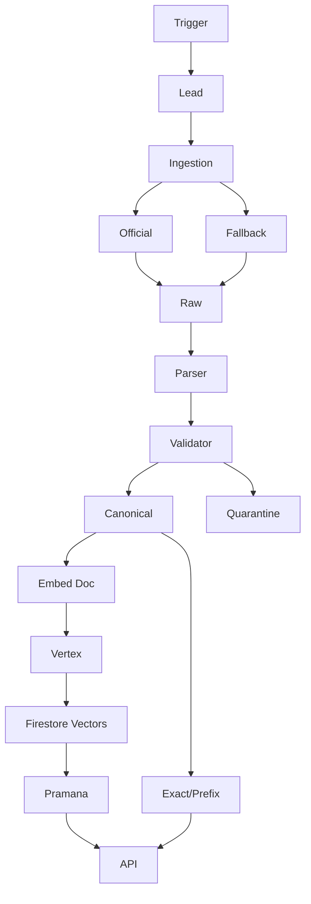

# Architecture — Aksantara KBBI Fuel Layer

## Overview
Aksantara performs difficult KBBI work once upstream, then feeds lighter downstream dictionary engines. Canonical pipeline:

```
Official KBBI → immutable raw snapshots → deterministic parser → validated canonical corpus
→ Vertex AI gemini-embedding-001 (768d) → Firestore vector search → cited Aksantara Pramana retrieval
→ versioned downstream projections
```

## Components
- **Trigger / CLI** (`scripts/`) — manual fetch, batch import, manifest verify
- **Lead Orchestrator** (`agents/lead.py`, ADK 2.8) — run lifecycle, policy gates, retries, manifests, escalation. Cannot mutate lexical values.
- **Ingestion Agent** (`agents/ingestion.py`) — selects transport, applies rate limits, archives raw bytes, computes hashes, records metadata, resumes batches. Does not interpret definitions.
- **Retrieval/Normalization Agent** (`agents/retrieval_normalization.py`) — builds embedding documents, proposes anomaly mappings, evaluates retrieval. Cannot promote proposals to canonical truth.
- **Raw archive** — `gs://aksantara/raw/{source}/{date}/{hash}.html` + local `tests/replay/fixtures/`
- **Deterministic parser** (`parse/`) — `raw_bytes + SourceRef → KBBIEntry`, transport-agnostic, no LLM
- **Validator** (`validate/`) — authority, schema, provenance, conflict, quarantine, replay gates
- **Firestore** — `entries/{id}`, `entry_versions/{id}_{version}`, `vector_entries/{id}_{embVersion}`, `runs/{runId}`, `conflicts/`, `review_queue/`, `releases/`, `config/current_version`
- **Embeddings** (`embeddings/`) — document builder (compact canonical text), Vertex `gemini-embedding-001` (outputDimensionality 768), `EmbeddingStore` interface, Firestore KNN (flat, COSINE/DOT_PRODUCT/EUCLIDEAN)
- **Retrieval** (`retrieve/`) — exact → prefix → semantic KNN → optional Gemini 3.7-flash grounded generation (only from retrieved records), citations with sourceKind/edition/hash/mode/score, fail-closed unknown
- **API** (`api/routes.py`, FastAPI) — `/entries/{lema}`, `/entries?q=`, `/search/semantic?q=`, `/relations/nonstandard/{word}`, `/versions/*`, `/health`

## Data Flow


## Invariants
- Immutable raw snapshots, deterministic replay, idempotent sync, no silent overwrite
- Other corpora have no write path to canonical or authoritative vector namespace
- Re-embed only on contentHash change, retain version history, atomic pointer switch, rollback together

## Decisions Deferred
- SurrealDB / Milvus / Vertex AI Vector Search — after measured workload exceeds Firestore evidence (§11)
